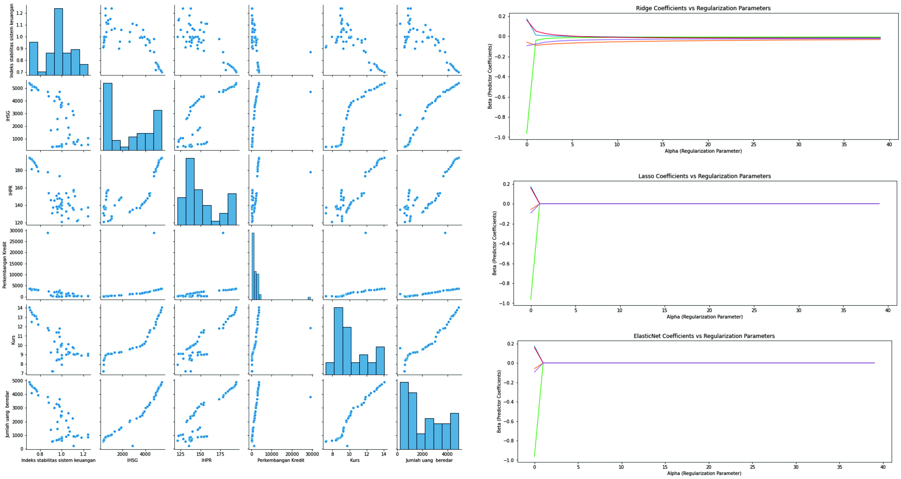

# Financial Stability Index

## Project Overview
The project to determine best regression models for Financial Stability Index data. I am performing comprehensive EDA on Mall Customer dataset to understand important variables, outliers, and apply machine learning models. The model used for this project are Linear Regression, Ridge Regression, Lasso Regression and Elastic Net Regression.

## Framework Steps:
1. Data Preparation
2. Data Cleaning
3. EDA
4. Feature Scaling
5. Modeling

## Result

